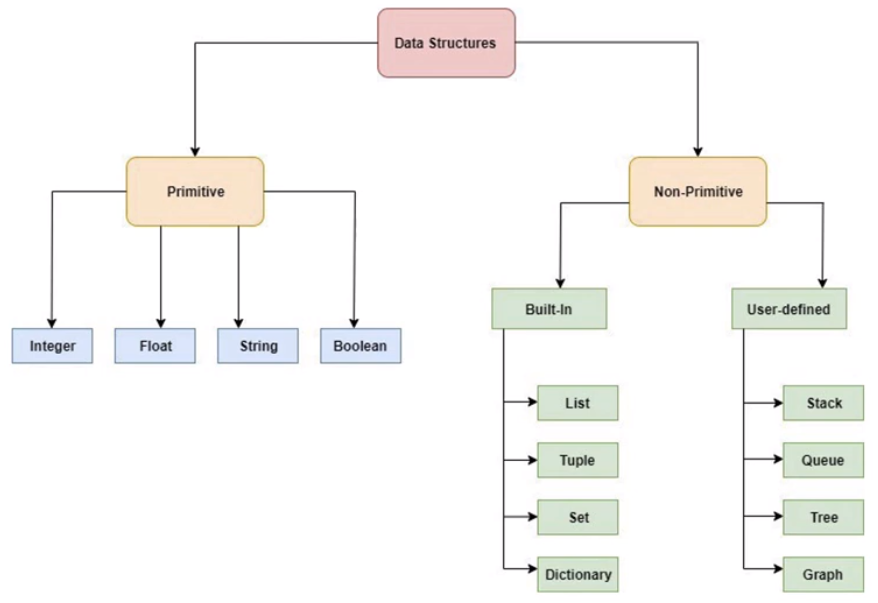

# 🎲 Tipos de Dados

Existem 4 classificações para os tipos de dados:

### 1. Com relação aos dados de memória do computador

Os dados podem ser:

1. **Numéricos (quantitativos)**
2. **Categóricos (qualitativos)**

### 2. Com relação à fonte

Os dados podem ser:

1. **Primários**
   1. Obtidos de geração própria, da própria empresa ou pesquisa
   2. Dados capturados de redes sociais, CRMs, sites da empresa
2. **Secundários**
   1. Dados obtidos de outras fontes (os dados não são públicos)
   2. Não podem ser adquiridos livremente

### 3. Em relação à linguagem de programação

Os dados podem ser:

1. **Primitivos**
2. **Não-Primitivos**

Em Python, temos:

### 4. Independentemente dos itens anteriores

Os dados podem ser:

1. **Estruturados**
   1. Têm classificação e lógica formal na esquematização
   2. Dados de Banco de Dados (linhas e colunas)
   3. Dados são tabulares e estrutura definida
2. **Não Estruturados**
   1. Dabos mais brutos
   2. Sem classificação ou esquema formal
   3. Obtidos de redes sociais, imagens, vídeos
   4. Requerem grande trabalho estratégico e operacional
3. **Semi Estruturados**
   1. Dados sem organização esquemática
   2. Já estão classificados de alguma maneira
   3. Pode ser um XML ou JSON
   4. Um trabalho de estruturação deve ser feito

Dependendo dos dados, você pode aplicar técnicas e estratégias de análise totalmente diferentes.